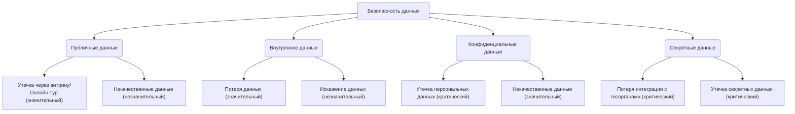

# Анализ системы PropDevelopment

## Категоризация данных по стандартам ISO/IEC 27001 и 27002

Публичные данные:

- Информация в онлайн-витрине о недвижимости, доступная клиентам.
- Данные из приложения Онлайн-тур.

Внутренние данные:

- Фонды недвижимости, управление импортом/экспортом данных об объектах недвижимости.
- Информация о сделках и клиентах (без персональных данных).

Конфиденциальные данные:

- Персональные данные клиентов (имя, адрес, контактная информация).
- Данные из приложения Онлайн-сделка.

Секретные данные:

- Информация о сделках и клиентах с персональными данными.
- Интеграции с госорганами.

## Риски

Публичные данные:

- Утечка данных через взлом онлайн-витрины или приложения Онлайн-тур (значительный риск).
- Некачественные данные, если информация об объектах недвижимости будет неправильно указана (незначительный риск).

Внутренние данные:

- Потеря данных в результате кражи носителей с данными или разрыва связи с серверами (значительный риск).
- Искажение данных при массовых операциях обновления фондов недвижимости (незначительный риск).

Конфиденциальные данные:

- Утечка персональных данных клиентов через взлом приложения Онлайн-сделка или хакерские атаки на базу данных (критический риск).
- Некачественные данные, если в процессе сделки будут неправильно указаны некоторые параметры объекта недвижимости (значительный риск).

Секретные данные:

- Потеря интеграции с госорганами в результате взлома или ошибок в коде (критический риск).
- Утечка данных о сделках и клиентах с персональными данными через взлом базы данных (критический риск).

## Mindmap визуализации рисков:

Обоснование оценки рисков:

- Для публичных и внутренних данных утечки и некачественные данные являются актуальными, так как любые проблемы могут привести к недоверии клиентов.
- Внутренние данные имеют значительный риск потери в связи с большим объемом хранящихся данных. Искажение данных незначительно, так как обновление фондов происходит редко.
- Конфиденциальные и секретные данные имеют критический уровень риска утечки из-за наличия персональных данных клиентов и интеграции с госорганами. Любая утечка приведет к серьезным последствиям для компании и доверию клиентов.
- Некачественные данные в конфиденциальных категориях могут быть значительным риском из-за прямого влияния на сделки недвижимости.
