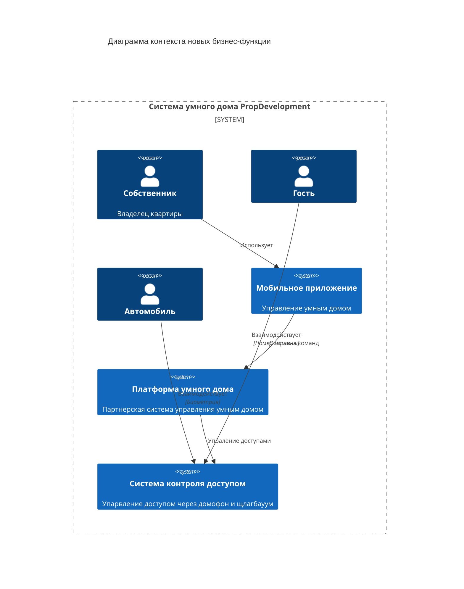

# Внешние интеграции

## Диаграмма контекста новых бизнес-функции

## Требования к внешним интеграциям

1. Безопасность:
  - Шифрование передачи данных (TLS/SSL) для всех API запросов между системами.
  - Автоматическое обновление и поддержка последних версий шифровальных протоколов.
  - Защита от SQL инъекций, XSS, CSRF атак через кодирование выводимых данных и фильтрацию входных параметров.
  - Ролевая система доступов (RBAC) для пользователей с различными уровнем прав.

2. Протоколы аутентификации:
  - OAuth 2.0 с использованием токенов Bearer для авторизации клиентских приложений.
  - JWT токены для сохранения состояния и быстрой проверки подлинности пользователей.
  
3. Взаимодействие систем:
  - REST API на основе стандартов OpenAPI/Swagger для взаимодействия между компонентами системы PropDevelopment и сервисами партнёра. 
  - Обмен данными в форматах JSON.
  - Синхронные (GET, POST, PUT) и асинхронные (WebSockets, Long-Polling) запросы для обеспечения взаимодействия.

4. Интеграция с мобильным приложением:
  - Внедрение SDK в мобильное приложение собственников PropDevelopment.
  - Обеспечение API ключей и секретов через хранилище конфигурации (например, HashiCorp Vault).
  
5. Ожидаемые события от партнерской платформы:
  - Запросы на добавление/удаление пользователей и разрешений доступа.
  - События об изменении состояния устройств (доступ открыт/закрыт, видео с камер).
  - Уведомления о нарушениях безопасности или проблемах с функционалом.
